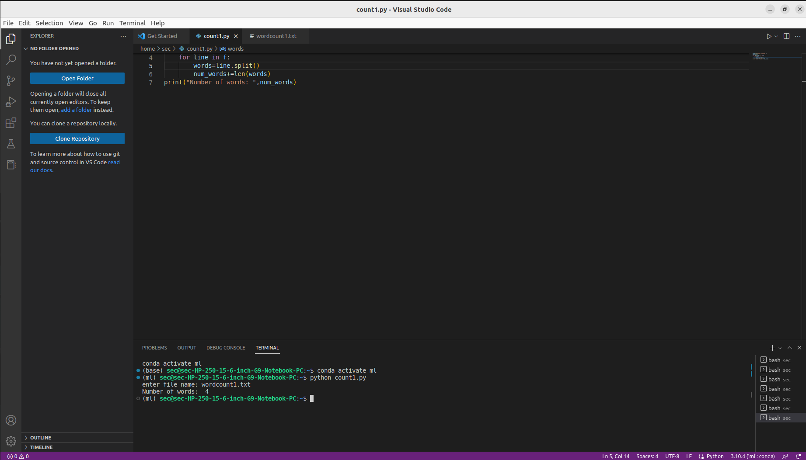

# Word-count
## AIM:
To write a python program for getting the word count from a text.
## EQUIPEMENT'S REQUIRED: 
PC
Anaconda - Python 3.7
## ALGORITHM: 
### Step 1:
Get the input text file name from the user to count the words in it.

### Step 2: 
Assigning a variable num_words is 0 
### Step 3: 
Opening the text file which the user entered
### Step 4:  
Split the words in the file using spaces between them using for loop.
### Step 5: 
num_words increases for every word in the loop iteration
### Step 6: 
Print the number of words and end the program.
## PROGRAM:
```
#program to get the word count from a file.
#Developed by Akshayaa M
#register number 22008405

fname=input("enter file name: ")
num_words=0
with open(fname,'r') as f:
    for line in f:
        words=line.split()
        num_words+=len(words)
print("Number of words: ",num_words)
```
### OUTPUT:

## RESULT:
Thus the program is written to find the word count from a text.
